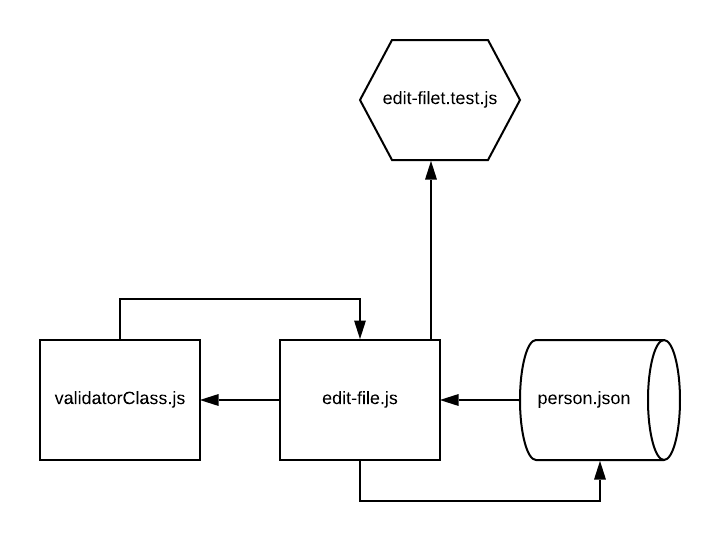

# LAB - 03

## Edit File

### Author: David Vloedman

### Links and Resources
* [submission PR](https://github.com/david-vloedman-401-advanced-javascript/401-lab-03/pull/1)

* First PR was closed on first submit, I'm adding the second one I opened for finishing the project post-initial submit: [Here](https://github.com/david-vloedman-401-advanced-javascript/401-lab-03/pull/2)
* [travis](https://www.travis-ci.com/david-vloedman-401-advanced-javascript/401-lab-03/builds/143785805)

#### Documentation

[JSDoc Index](./docs/index.html)

### Setup

npm install

#### How to initialize

npm start
  
#### Tests

npm test

#### UML

